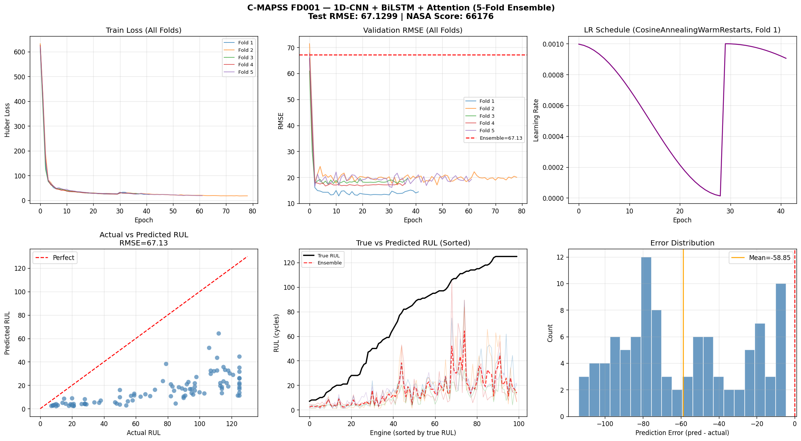

# C-MAPSS Remaining Useful Life Prediction
### 1D-CNN + BiLSTM + Multi-Head Attention

Remaining Useful Life (RUL) prediction for turbofan engines using the NASA C-MAPSS dataset (FD001 subset). Uses a hybrid deep learning architecture combining 1D-CNN for local feature extraction, BiLSTM for temporal dependencies, and Multi-Head Attention for long-range pattern recognition.

---

## Architecture

```
1D-CNN (64 filters) → BiLSTM (128 hidden, 2 layers) → Multi-Head Attention (4 heads) → Dense regression
```

Each component serves a distinct role:
- **1D-CNN**: Extracts local temporal features and reduces sequence noise
- **BiLSTM**: Captures bidirectional temporal dependencies across engine cycles
- **Multi-Head Attention**: Focuses on long-range patterns critical for degradation modeling

---

## Features

| Component | Detail |
|-----------|--------|
| Normalization | Global StandardScaler across all training engines |
| RUL Cap | 125 cycles (piecewise linear health index) |
| Sequence Length | 30 cycles |
| Sensor Features | 14 selected sensor channels |
| Loss Function | Huber loss (delta = 10) |
| LR Scheduler | CosineAnnealingWarmRestarts |
| Validation | 5-fold cross-validation |

---

## Dataset

**NASA C-MAPSS FD001**
- 100 training engines
- 100 test engines
- Single operating condition, single fault mode
- Source: [NASA Prognostics Data Repository](https://www.nasa.gov/content/prognostics-center-of-excellence-data-set-repository)

---

## Training

- **Epochs**: 150 per fold
- **Hardware**: Kaggle GPU (T4 / P100)
- **Framework**: PyTorch

---

## Results

> **Note**: Model is being optimized — results will be updated soon.



---

## Kaggle Notebook

Full implementation available on Kaggle:
[cmapss-rul-transformer-lstm-v2](https://www.kaggle.com/code/akobirmusaev/cmapss-rul-transformer-lstm-v2)

---

## References

- Saxena, A., et al. (2008). *Damage Propagation Modeling for Aircraft Engine Run-to-Failure Simulation.* IEEE PHM Conference.
- NASA C-MAPSS Dataset — Prognostics CoE at NASA Ames
